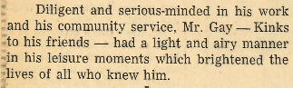

**By Ariel Cordes, Contributor** _uploaded at 1:55 p.m. on Thursday, November 8, 2018_

It is now November, the month in which we lose the most daylight per day, leading to things like the sun going down before 6 p.m., people with Seasonal Affective Disorder having their moods worsened, and those lucky bastards without souls remaining chipper as always. So, given this, I thought it appropriate to perhaps offset this depressing fact with an amazing, yet no less true, one. 

You almost certainly know of the namesake of Gay Hall, Clayton A. Gay. If you do not, he was a judge who donated enough money to the university that they named a residence hall after him. Now, besides the obvious pun based on the potential insertion of commas (Clayton, a gay hall), there is yet another, and perhaps even more entertaining fact. I recently discovered an interesting fact in the editorial of Mr. Gay’s obituary, which was printed in the Morris Tribune. I received a scanned copy of the October 3, 1958 issue’s relevant pages from the Stevens County Historical Society. 

You see, it seems that Mr. Gay had some “friends.” And it seems that these “friends” (I hesitate to refer to them as such because of the following information, but I have no better terms) referred to him as “Kinks.” 

Yes, you read that correctly. Clayton A. Gay, namesake of our very own Gay Hall, was called “Kinks” by his “friends.” Clayton “Kinks” Gay. Has a nice ring to it, don’t you think? 

See, Mr. Gay was referred to by the general community as just that — Mr. Gay. However, I should think we here at the University of Minnesota Morris have a closer relationship with him than the community at large. One might call us acquaintances, associates, contacts… perhaps even… “friends.” 

It follows, then, if we are his “friends” (and what good friends we are), that we would call him “Kinks,” as his other friends did. And it would follow from that that we call Gay Hall not simply that, but either “Gay Kinks Hall” or simply “Kinks Hall.” And from that we can safely conclude that the Tug should be renamed from the Tug to the “Gay Kinks Johnson Tug,” in honor of Independence Hall’s namesake as well. 

Now, I realize that this might be somewhat difficult to believe. A namesake of one of our own halls on campus’ nickname being “Kinks?” How ludicrous! It’s almost as ludicrous as… as… as having a hall called “Gay Hall!”

Now rest assured, I did not make this up. It is far too unbelievable to be fictitious. I understand your skepticism, though, and so, I will attempt to include a screenshot of previously mentioned scanned editorial, specifically the relevant part.

Now, I hope, like those who knew Kinks, that I have brightened the lives of those reading this. And I hope that, for at least a moment, we can both forget about the waning daylight and appreciate the fact that we can now refer to a residence hall as “Gay Kinks Hall.”