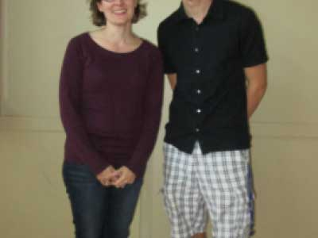

**Written by Geordi Jones, Feature Editor** _originally published in Issue 2, Volume 31 of The University Register on Friday, September 28, 2018_

UMM’s very own Swing Club is celebrating their 20th anniversary this year! As part of the homecoming festivities last weekend, club co-founder Jennifer Rogers met with current club co-chair Jamin Stagg to discuss the history of Swing Club, how it has evolved over the past two decades, and what has stayed the same. 

Rogers started by sharing the history of Swing Club from her first-hand experience with Stagg and our correspondent Tehya Wachuta. Prior to the club’s founding in the fall of 1998, Dance Ensemble had hosted some swing dances and swing dance lessons as part of their multiple club activities. The founding of Swing Club, during Rogers’ sophomore year, was an outgrowth of this. Part of the inception of Swing Club handled some special logistics that other clubs do not have to consider, such as liability clauses, since swing dancing can be physically intense and dangerous if not done properly. Rogers fondly recalled sitting in the student activities’ office, writing the clause “in the event of unsafe dancing practices” in the club’s constitution, which she noted has not needed changes since her clubmates revised it in 1999. At the first lesson of Swing Club, around 100 people attended, far more than Rogers was prepared to teach. With the help of other dancing couples scattered throughout the room, and one student’s handy whistle, the new Swing Club officers taught a West Coast-style of swing dancing, teaching each turn, step, and move one at a time. At its inception, Swing Club met approximately once a month, and at each meeting, Rogers and the other officers would pick up the lesson where they had left off the last time and continue teaching new moves. 

One of the co-founders of Swing Club in 1998 was John Vo, a fifth-year student at the time. Tragically, Vo passed away in the summer of 1999 in a swimming accident in Bush Lake. Rogers reached out to the University Register to cover this momentous anniversary of Swing Club, saying “it is especially meaningful to me that [Vo’s] legacy of the Swing Club lives on today.”

In keeping with Vo’s legacy, Stagg noted that not much has changed in regards to the lessons taught by Swing Club. He said that at the beginning of the term, around fifty people attend the first few lessons. He also mentioned that the officers still use the same rehearsal space, the RFC Multipurpose Room, that their predecessors did when they have that many attendees. Instead of a whistle, however, Stagg has the room of dancers repeat a clapped pattern until he has control of the room. Stagg also stated that around midterm, the lesson attendees have usually dropped in size to about half, leading to a more manageable group that can fit into a small space. 

Stagg and Rogers also discussed future possibilities for Swing Club. Rogers suggested a return to the past, and told stories of the jazz dances that once took place in Oyate Hall. Working with several of the on-campus jazz ensembles, a swing dancing contest would be held with prizes for the first, second, and third-placing couples. Sometimes, Swing Club would teach a twenty-minute lesson prior to the contest so that more people would be able to participate. Stagg was intrigued by these contests, and said that he would be interested if more contests were to be held now. He also mentioned plans he has for future swing dancing lessons. He wants to teach new dancers an easier, on-beat style of swing before transitioning into a harder, more complex style. He also wants to focus on an improvisational style of swing dancing, which would encourage dancers to experience new partners and learn how to both lead and follow while dancing. 

Rogers and Stagg compared thoughts on their passion for swing dancing. When asked what they enjoyed most about swing, Stagg responded emphatically, saying, “It makes me so happy to dance in general, and I love teaching people things and seeing what will make them understand it better. It’s always a good time, and everyone’s there, present and dancing. You’re all together, trying to do the same thing on the same wavelength; dancing. I just love that atmosphere so much.” Rogers agreed, and said that though she is not swing dancing currently, she believes that “social dance and swing is a lifelong sport. I feel like there’s another chapter in my life where I pick that back up.”

One thing for certain has not changed in the last twenty years of Swing Club: the officers share a passion for helping the students of UMM discover a new fact of their identity through swing dancing. Interested in swing dancing? Stop by the RFC Multipurpose Room Monday nights at 9 p.m., and Swing Club will set you up!

_Above: Jennifer Rogers and Jamin Stagg. Photo by Tehya Wachuta_

_Image at top created by Tehya Wachuta, with stock images by Ioulia Bolchakova_