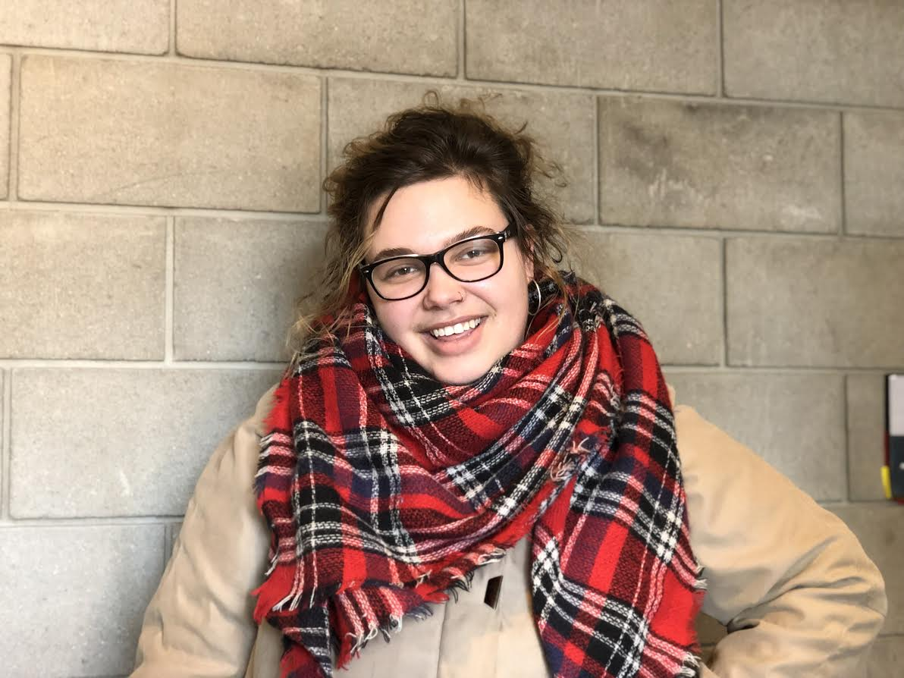

**Written by Geordi Jones, Feature Editor.** _Originally published in Issue 10, Volume 31 of The University Register on Friday, March 8, 2019._

This past Saturday, the Meiningens Student Theatre Organization hosted their semi-annual Play in a Day event. In partnership with MoQSIE for their Pride Week events, this Play in a Day was LQBTQIA2S+-themed, or more humorously dubbed “Gay in a Day”. Starting at 9 p.m., four playwrights gathered in the 24-hour study lounge to crack out four brand-new plays to be presented the following evening. The following morning, rehearsals started at 8 a.m., with actors and directors working hard to get these new plays in performance shape before 9 p.m.

_Sappho is my Wingman_ is a new comedy written by Rachael Knafla. It is a comedy about Artemis, a recently out lesbian, who meets Sappho, the ancient Greek poet and gay icon, in the modern era. Sappho teaches Artemis how to woo her major love interest Alex using Sappho’s own poetry. _Sappho is my Wingman_ was directed by Maggie Caplan. Caplan also recently directed this winter’s production of She Kills Monsters. Both Knafla and Caplan are veterans of Play in a Day. Acting in this play were Hannah Retzer as Sappho, Emma Fedor as Artemis, and Emily Kjenaas as Alex; the latter two were both new to Play in a Day. 

_Bloom_ is a transgender narrative written by Adriel Mihailidis, a freshman and newcomer to Play in a Day. _Bloom_ begins with an attempted suicide, and the hospitalization afterwards, lightly touching on the struggles of transgender people in these environments. The main character, Alex, meets Robin, who will quickly become his best friend in times of need. After coming out to his mother, Alex goes to college and finds Robin again, along with Kaiden, a friend of theirs from the hospital. After struggling with depression again, Alex is able to get proper help and reemerge as his and Kaiden’s relationship grows. Towards the end, the Narrator and Alex turn out to be the same person, with the Narrator representing Alex post-HRT. In the end, the Narrator and Alex recite the end to the poem side-by-side, as their life continues, like a flower in bloom. _Bloom_ was directed by Wyatt Anderson, and featured the acting talents of Elijah Bass as the Narrator, Caroline Vodacek as Alex, Johannah Woodley as Mother and Robin, and Aaron Otten as Kaiden. 

_Sword Dance_ is a comedy written by Leah Judd, a new face in the writer’s room. After learning about each other's duties, a Princess and a Knight strive for the most ambitious achievements using their newfound skills: the Princess will slay a dragon, and the Knight will host a ball and invite the King. When the King, still grieving the death of his wife, shockingly accepts the invitation and attends the Knight's ball, an unlikely bond begins to form. The Princess succeeds in slaying the dragon and is knighted for her grand heroism, and the King and Knight fall in love. _Sword Dance_ was directed by Laura Steblay, and was performed by actors Angelica Cullen as the Princess, Spencer Hammersten as the Knight, and Bryan Doty as the King. 

_The Doomsday Blizzard of 2019_ was a comedy (she swears) written by Paige Quinlivan. I got the chance to speak with Quinlivan about her play, and she said “[it] was meant to be a sort of meditation on leaving college & dealing with change, as well as the inherent absurdity of young adult life. It is about two recently graduated friends, Lane and Ezra, who, after inviting a stranger up to their apartment, discover that the world is about to end. It is not really about that though---it is really about their relationship, how disconnected they are from each other, and how only the end of the world could really mend their relationship.” _The Doomsday Blizzard of 2019_ was directed by Evan Aanerud, and featured student actors Katie Booth as Lane, Bailey Soika as Ezra, and Brianna Williams as Margot.

**Evan Aanerud - Director of _The Doomsday Blizzard of 2019_**

“I had a wonderful and fulfilling experience as a director. I really enjoyed collaborating with my actors. We had a tight-knit group, and the overall group dynamic was so positive and uplifting. It was really fun to experiment with new and crazy ideas and take the script where we wanted. The biggest challenge for me is always the middle of the day during lunch, when everyone is tired and doubtful that their play will be ready in time. The rehearsals following lunch are very important because they really determine the success of the show!

This year's Gay in a Day was very special. There was a great mix of playwrights, directors, and actors. What I most appreciated was the collaboration between upper- and lowerclassmen. I just love how experience or background in theatre is kind of thrown out the window once rehearsals start. Everyone is equal on this playing field, and we all have to work together to put out a great show!”

**Paige Quinlivan - Playwright of _The Doomsday Blizzard of 2019_**
“My favorite part of Play in a Day is always staying up with my fellow playwrights. There’s an air of camaraderie that I really love, as we stay up until the crack of dawn. It's sort of miserable, and also so, so fun. 

This was such a special last Play in a Day. All of the plays were wonderful and it was a great to share this experience with the other playwrights!”

**Maggie Caplan - Director of _Sappho is my Wingman_**

“I had a really wonderful time directing at this Play In A Day. As soon as I arrived to pick scripts in the morning my eye was drawn to _Sappho Is My Wingman_, I loved the premise, the sense of humor, and the message it sent, and couldn’t wait to get started with the actors. It was the very first Play In A Day for two of them, and we had a great time navigating all the ins and outs of the process. I’ve been doing Play In A Day since I was a freshman, and this was my very last one, so it felt kind of symbolic to usher in two new people to my very favorite day of the year. The show itself was a blast to work on. It combined poetry and prose in a really fun, unique way that the cast and I spent a lot of time wrangling, and figuring out how we wanted to tackle each of the poetic sections may have been my favorite part of the day. My biggest challenge with this round was just the sheer exhaustion, I hadn’t slept the night before and crashed pretty hard in the middle of the day. Fortunately, the cast was right there with me, and we worked together to bring up that energy. It was actually one of the smoothest, most efficient, purely fun Plays In A Day I’ve ever done, and I couldn’t be happier that this is the one I went out with.” 

**Rachael Knafla - Playwright of_ Sappho is my Wingman_**

“This is the third Play in a Day I've written for, with last year's Gay in a Day being the first play I ever wrote. While I'm a bit more comfortable writing plays at this point, I still get much of the same excitement and nervousness that I got the first time I wrote for [Play in a Day]. It's entirely so rewarding to see my story brought to life, especially with the help of a director and actors that want to have fun with it. 

I would say my favorite parts [of Play in a Day] would be when I'm writing and all the pieces flesh out and come together perfectly at the end. 

The biggest challenge is probably making sure that the dialogue is written in a way that is in-character and/or natural. It makes me cringe when I see my show performed and I realize I should have written a line differently. 

This semester, there were two writers joining us who were new to writing for [Play in a Day], and it was such a privilege to help and see their ideas flourish. It reminded me of when I started out and I enjoy that it gave me an opportunity to give back to first-time writers.” 

**Laura Steblay - Director of _Sword Dance_**

“Throughout my time at Morris I've acted in, produced, and now directed for Play in a Day, and it's always one of my favorite days of the semester. Gay in a Day is extra special, so knowing this was my last Play in a Day here is bittersweet. I love seeing the creativity and sense of community that sprouts when people pull together to work towards a goal in only 24 hours. As a director, my favorite moments are when my cast and I unexpectedly stumble upon a detail that ends up being a really fun moment in the show. This semester, we had trouble deciding where the Knight and King's hands should go when they were waltzing together, so we made that moment of moving the hands back and forth in indecision part of the moment, and the audience loved it. 

Cultivating spaces for such an unashamed and supportive celebration of creativity, queer stories, and trying new things is so valuable, and I'm so thankful I've had the chance to experience this. I encourage anyone who is interested to do Play in a Day, it's truly a one-of-a-kind day and I can promise you won't regret it!”

**Adriel Mihailidis — Writer of _Bloom_**

“At its core, _Bloom_ is a new slice-of-life about a transgender man growing up and learning to live again in the new environment of college, combining both poetry and prose. It deals with the struggles of depression, transphobia, and mental health.

This was my first experience with Play in a Day. The environment was very accepting and helpful, and any challenges I had were easily helped by the support of fellow LGBTQIA2S+ peers. My favorite part of the process for PiaD would have to be being able to talk through ideas in an accepting environment and seeing the final product of how the director’s interpret the writing. The biggest challenge was the writing itself, as it is a very short time to write a play in, however these fears were easily consolidated by the support of others. Additionally, the final product and seeing people’s positive reactions made all the challenges worth it. It is such a good feeling, despite the anxiety, to be able to see something I wrote be brought to life in a safe and accepting environment, and especially in such a short time.”

**UMM Student Playwright D.C. Bound**

Paige Quinlivan received very exciting news on Tuesday, March 5 that she and her play _John Hughes Wrote My Diary_ are invited to be showcased at the national Kennedy Center American College Theatre Festival in Washington, D.C. this coming April to compete for the John Cauble Award for Outstanding Play. As you may recall from an earlier issue, Quinlivan’s play was performed as a concert reading at the region festival in Sioux Falls, SD this past January as one of three selected pieces out of 54 submissions. Now, Quinlivan’s play will be competing as one of the eight finalists selected from all over the nation to compete for the John Cauble Award.

_John Hughes Wrote My Diary_ was originally a piece written for the very first Gay in a Day. Now, it is moving on to be recognized at the national level, and will be cast with professional actors.
