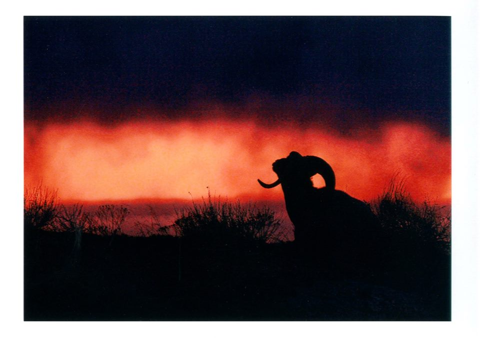

**By Tehya Wachuta, Feature Editor** _originally published in Issue 6, Volume 30 of The University Register on Friday, December 8, 2017_

To celebrate International Education Week, UMM held an International Photo Contest. International Education Week is held to encourage Americans to study abroad and International students to study in the U.S. International Student Success Coordinator Leslie Lindberg has organized the photo contest for the past six years, and all students were able to submit photos. This year, there were 16 submissions. Below are the stories of the top three submissions for this year.

**Guilia Defant**

Guilia Defant’s photo, taken in Nepal, won first place in the International Photo Contest. Defant was in Nepal in January of 2017 with a friend when she saw the woman pictured in her photo.

“One day, [my friend and I] were walking around in the market and we decided to go see different things,” she said. “We kind of got lost and I was hungry, so I got some bananas from a street vendor and I sat on a curb in a street that was not too trafficked with rickshaws, and people screaming, and scooters. I was just eating my banana and I saw a woman right in front of me, and she was laughing and giggling. I don’t know why she was laughing—she probably had never seen a white, blond young woman—so I got up and I asked her if I could take a picture of her. I tried to learn some words in Nepalese, and I learned ‘You’re beautiful’ in Nepalese, so I told her.  I don’t even know if she understood what I was saying, but I just wanted to tell her. And then I took a picture of her and I showed it to her, and my friend found me and took a picture of me showing her the picture.”

Defant chose to submit this photo because of how important that particular photo is to her.

“It meant a lot to me. It was a moment that I cherish a lot. I love connecting with people, especially strangers, and trying to blur the line between people you know and people you don’t. Trying to connect with other people is always a very enriching experience. “[My favorite thing about the photo is] two women coming from very different cultures, countries, with two different languages, just coming together and sharing a moment, empowering each other. It was very beautiful; we were both looking at each other with eyes of curiosity.”

Defant will donate her prize money to a non-profit organization in Nepal.

**Rhiannon Kunesh**
  

UMM senior Rhiannon Kunesh won second place for her photo of a beach in Italy. She studied abroad in Galeway, Ireland for a semester during her sophomore year and used her week-long break to travel to Cinque Terre, a string of five villages on the coast of Italy.

“I would wake up and go down to the bakery and grab a loaf of bread for my lunch, and I bought jam, so I would get some fruit for breakfast, pack that up, and then hike to the different villages,” she said. “There was Riomaggiore, Vernazza, and Corniglia, and I hiked to those different days, and I took a train to the furthest one, which was where the beach was. I didn’t want to use my towel because it was my only showering towel, so I took my bedsheet to lay on the beach with. And I got what I wanted — I had the sun, and I had a strawberry daiquiri on the beach because it was legal for me when I was there. It was great; I spent a week in the Italian sun hiking and eating so much pasta and pizza and gelato. It was a really cool string of villages, and it was very empowering that I made the trip by myself.”

Kunesh chose that photo for her submission because it captured the color and beauty of her trip.

“To me, [that photo] captured the beauty of the villages I was in, because it had the ocean, which was just bright blue teal, and the buildings, which were all different colors. It captured both the ocean, which was a huge part of being on the coast, and the colorfulness of Italy and the villages I was in perfectly. It wasn’t altered at all, which shows just how bright it really was.”

What she enjoys most, however, isn’t just the vibrant colors, but knowing she was there.

“It’s such a pretty picture that I could get it on a postcard,” she said. “Just knowing that it was such a beautiful, lively place, and that I was there, and I took that picture and I stood where the people were standing in that picture is very cool, knowing I experienced something like that.”

Kunesh encourages all students who have a desire to travel to do so.

“I come from a low-income family, and I’m a very small-town, average girl, and I’ve still managed to have these adventures,” she said. 
“I’m going to be studying abroad for the third time this January, and I’ve had really cool adventures and experiences, and anyone can do it. If you really want to, you can [travel] even if you don’t necessarily have the money right now or have no idea where you’d want to go. You can see real-life things that look like postcards.”

**Samuel Yuan**

UMM junior Samuel Yuan’s photo of a ram in the Badlands, South Dakota won third place in the International Photo Contest.

“I went to the Badlands last spring break. I was trying to take photos, but we couldn’t find any wild animals,” he said. “In the evening when we drove out, we saw a group of sheep with big horns and we stopped and tried to approach them without frightening them, so we were crawling on the ground for almost 20 minutes. And then we took pictures, and it was during the sunset, so everything was so beautiful. We were shooting for almost half an hour to an hour, and we went back to our car and saw five cars waiting behind us. They saw us taking photos and were waiting for us to give us a quiet environment. It really touched me — their respect to us, to the nature.”

Yuan has been involved in photography since middle school, and although he enjoys the photograph itself, what really stands out to him is the respect that observers displayed toward his photography.

“I took a lot of photos around America, but I that one was the first time I felt other people’s respect for people. They know you’re a photographer and they don’t want to ruin your chance to take a perfect picture. And the picture itself is really beautiful; the head is right in front of the sun.”

Yuan enjoys the memories a photo can bring, and the joy they can bring to others.

“You can capture a moment and show it to people. Normally, I take photos for my friends and I show it to them, and they can have good memories — they look back and have a picture to record moments from years ago. Now, I’m more focused on nature photography and the process of making photos outside in nature.”

_Photos courtesy of UMM Flickr_