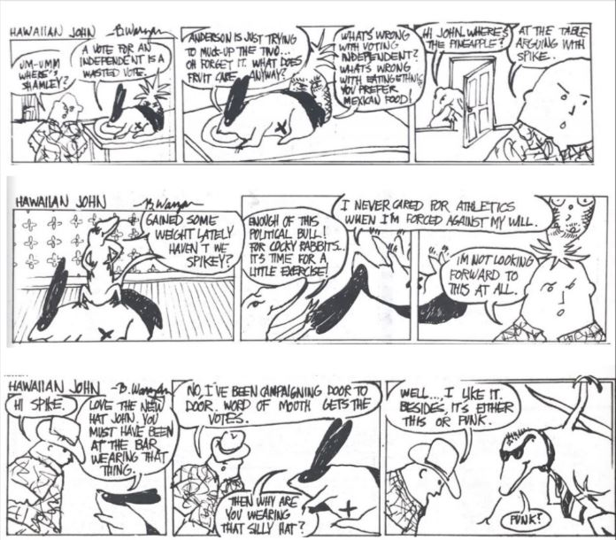

**By Desmond Homann, Variety Editor** _Originally published in Issue 3, Volume 32 of The University Register on Friday, October 11, 2019_

Some of our readers may have noticed in the last issue of the University Register that I chose to include a selection of comics from a previous UR content creator and Morris student. While I thorougly enjoyed the work of Erik Anderson and found it to be relevant still today, it would appear that the 1980s featured another talented Morris artist: Brad Waryan.

Brad Waryan graduated from Morris in 1981 and went on to do art, spend time outdoors, and work as a chef. Though Waryan unfortunately passed in 2012, it is clear that his time at Morris, along with the other factors of his life, left an impact on those around him. I was recently asked to look into old issues of the UR to check out what the Variety section contained in past years. This is absolutely the sort of thing I would do without being asked, but I appreciated receiving the little nudge that I needed to crack open the file cabinets and sift through the old issues we have been hiding away. I will admit, I spent a great deal of time skimming through these old copies of the paper, marvelling at how much has changed and laughing at how much hasn’t. As I stated in the previous issue, goofiness remains a constant in life and between college students.

I’m not totally sure I understand what is going on in Waryan’s comics, but I enjoy how sassy these little animals are, almost reminding me of Opus the Penguin. (When did those comics come out? Which came first? Oh well, it’s okay to enjoy them both.) In fact, when I was first asked to hunt down these comics, I was told that I would know they were the right ones when I saw the funny animals.

Maybe in future UR issues I will attempt to incorporate old Variety content again. I always have a lot of fun digging through old articles, art, and creative writing, and
it’s good to take a look back every once in a while to make sure the hard work of these Morris students does not go unnoticed. All of us here at the UR work too hard to go unnoticed, so I hope that someday down the line there is another Variety editor who looks back on our issues too. I hope they aren’t embarrassed to have shared a section with me! I suppose we’ll see what happens.

